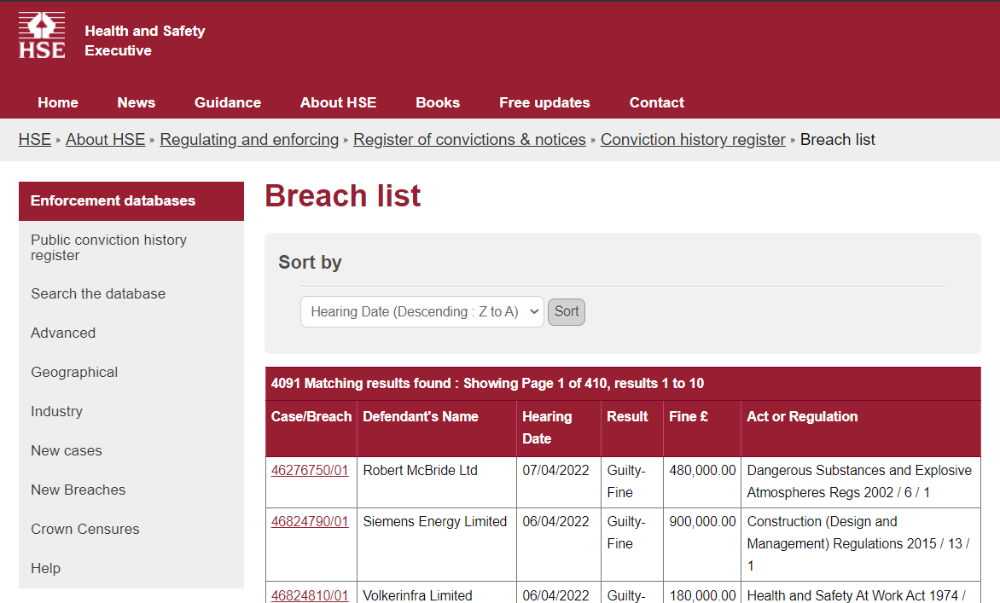
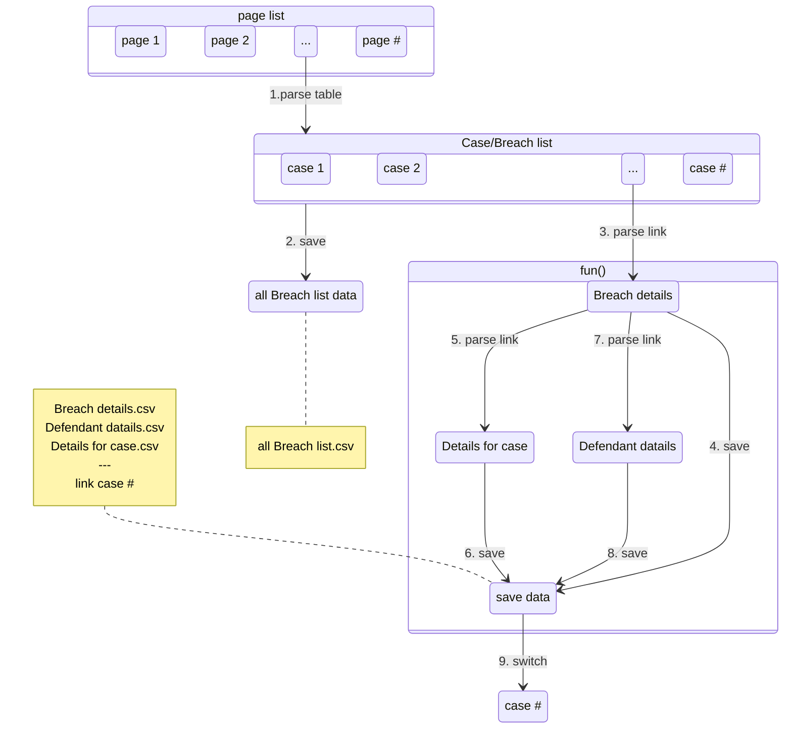

key: `requests` `pyquery` `selenium` `cursor`

> workshop.w2 (网络数据收集主题)


> ##  分享内容快速预览：
- chatGPT 对话场景下,自我学习以下内容
- python 基础回顾、完善、补充3 (语法;流程控制;逻辑处理;面向对象编程;面向函数编程;等基本概念)
- python 网络数据整理或收集 (`request`;`pyquery`;`selenium`)
- 结合 AI工具 完成，网站数据请求，数据响应获取；网页结构，标签解析等；
- 自动化测试工具 selenium 请求动态网站数据；

>  python 基础
- 字典
- 数组
- 类
- 函数与方法

> html 标签
-  F12 chrome ,浏览器调试器
-  标签;
-  标签属性;
-  标签文本值;
-  css 选择器;

> 安装支持库:
- 打开 miniconda prompt 以命令行方式安装以下库

- `pip install pandas -U`

- `pip install pyquery -U`

- `pip install selenium -U`

  - `pip install webdriver_manager`

  - ```python
    from selenium import webdriver
    from webdriver_manager.chrome import ChromeDriverManager
    
    driver = webdriver.Chrome(ChromeDriverManager().install())
    ```

    

> ## case 1:  获取  [ Health and Safety Executive](https://www.hse.gov.uk/index.htm) 数据

!> 任务:  1）获取目标网页 [Breach list](https://resources.hse.gov.uk/convictions-history/breach/breach_list.asp?PN=1&ST=B&EO=LIKE&SN=F&SF=DN&SV=&SO=DHD) 下所有 pages 的 Breach list 表格数据（见下图Breach list）；2）从 Breach list 中解析出所有 Breach id 的超链接，并进一步获取该超链接的网页表格数据（见下图 Breach details）；3）对表格进一步解析得到 defendant details & case details 的超链接并获取次级表格数据。

[B站 同步更新 P1: 静态网页数据请求](https://www.bilibili.com/video/BV1Jv4y1E7KQ/?spm_id_from=333.999.0.0)

> 目标网页网址: 

  https://resources.hse.gov.uk/convictions-history/breach/breach_list.asp?PN=1&ST=B&EO=LIKE&SN=F&SF=DN&SV=&SO=DHD 




> 获取网站数据内容示图


>  设计数据请求流程:



> ## case 2:  获取   数据


> ##  🤔 case1.prompting 

!> 提醒: 以下内容是网络数据请求实现的prompting过程。
以下是 prompting 过程。

将使用 `python` 库：`Pyqeury``pandas``thread`

代码编辑器: [cursor](https://www.cursor.so/)

---

!>  对话式编程。备注:以下内容在代码块中的是 prompt 内容，带有🟢 是旁释

🟢1 访问
```txt
请使用 PyQuery 库解析以下网址中的 table 标签，并将其转换为 Pandas DataFrame，并将其保存为名为 df 的变量.
https://resources.hse.gov.uk/convictions-history/breach/breach_list.asp?PN=1&ST=B&EO=LIKE&SN=F&SF=DN&SV=&SO=DHD
```

🟢2 检查df 是否要目标网页数据一致 ,这个网站的数结构是多级索引的, 为方便取值先对df进行处理

```txt
DataFrame 变量 df 是多级索引的 ，请将第 0 层的 columns 索引删除。
```


🟢3 分析网页,开始获取a标签的文本与属性值

```txt
获取 table 标签下的所有子级 a 标签, 并打印a 标签的文本值
```

🟢 4 修改代码

```
修改代码, 当获取 a 标签文本时,判断是否在变量 df 的第一列中,如果是的话将其保留, 并打印出 a 标签的 href 属性值
```

 🟢5 这里查看代码时，发现href 没有加前缀，分析下网页网址结构后，需要添加的前缀是`https://resources.hse.gov.uk/convictions-history/breach/`

```
修改代码,将符合条件的 a 标签 href 属性加前缀 `https://resources.hse.gov.uk/convictions-history/breach/`
```

🟢6 测试一下这些超链接的正确性,如果没问题, 那将 用a标签文本作为key ,href属性值作为values 构建一个 python 字典, 

```
创建字典,href_dic, a 标签文本作为 key, a 标签 href 属性值作 value, 最后将 href_dic 转为命为 hrefdf 的 pd对象
```

🟢7 合并列, 对齐的名

```
代码内容增加,将 hrefdf 的第一列列名修改为 df 的第一列名,之后 df 与 hrefdf 按第一列列名 进行交集合并  
```

🟢8 由于该方法会经常被用到,所以在这里将这个方法封装成函数或方法, 全选代码,再对话

```
修改代码, 请将这段代码封装成名为 get_breachlist 的函数方法,   输入参数是 url ,返回结果是 merged_df
```

```
修改 增加一个方法执行时的异常情况判断, 如果解析时 table 没有返回值 或空 或异常, 则返回  None
```

🟢9 到此,我们已经完成对对给定 url 的网页数据请求,剩下的工作是构建 page url 就能用一个循环语句获取所有pages 的数据。首先交给chapGPT分析下page 网页的结构

```🤔
url = 'https://resources.hse.gov.uk/convictions-history/breach/breach_list.asp?PN=1&ST=B&EO=LIKE&SN=F&SF=DN&SV=&SO=DHD'
url = 'https://resources.hse.gov.uk/convictions-history/breach/breach_list.asp?PN=2&ST=B&EO=LIKE&SN=F&SF=DN&SV=&SO=DHD'
url = 'https://resources.hse.gov.uk/convictions-history/breach/breach_list.asp?PN=3&ST=B&EO=LIKE&SN=F&SF=DN&SV=&SO=DHD'

分析上面的规律, 创建一个函数生成对应的 url 字符串
```

🟢10  生成410个url，

```
使用 generate_url 方法 生成 410个网址 并且 保存在 urlist 数组中
```

🟢11  循环执行 get_breachlist 方法，直到结束。（串行获取速度慢）

```
遍历 urlist 数组, 执行 get_breachlist 方法,将返回值保存到 relist数组中
```

🟢12 下面我们改进代码,使用多线程进行的数据获取，先删去刚才的循环语句

```
用多线程方法 启动 get_breachlist 方法,传入 urlist 中的 url直到urlist为空
```

```
修改代码, 保存返回结果时使用线程锁,当结果每增加50个时通知我修改代码, 保存返回结果时使用线程锁
```

🟢13 保存结果，到本地*.pkl

```
将pandas 类型的变量 df ,保存为  breachlist 的pkl 文件
```

---

🟢14 获取二级表，所有 case 对应的 `breach details` `details for case#` `Defendant details`  

 ```
用pandas 读取 目录下 breachlist.pkl文件
 ```

```
取出变量df的 列名为 href 的第一个元素 保存为变量 url
```

🟢15 这里开始试试内容更多的 prompt 

```
创建一个方法 get_dicdf,传入参数是 url: 1,用pyquery 解析url table 标签, 并将其转换为 Pandas DataFrame, 变量名为 tdf,  如果解析异常或失败时返回none 如果一切返回 变量 url 为key 与 变量 tdf  为value组成的的字典
```

```
创建一个方法 get_datails ,传入参数是 url: 1,用pyquery 解析url table 标签, 并将其转换为 Pandas DataFrame, 变量名为 tdf,  2,获取 table 标签下的所有子级 a 标签的 href 属性值, 判断属性值 如果包含 "case_details" 或 "defendant_details" 字符,则分别对应的加上 "https://resources.hse.gov.uk/convictions-history/case/"  ,  "https://resources.hse.gov.uk/convictions-history/defendant/" 分别存入clist 与 dlist 数组中, 都不包含的情况下, 跳过 ; 3 上述的任何情况只要解析失败或异常时,请抛出异常返回none ,一切正常时, 请返回 url为key , tdf为value的字典, 以及 clist dlist
```

```
调用get_dateils 方法, 将返回值分别等于 resdic , clist dlist, 
如果 resdic 不等于 none 时, 
先判断 clist 元素大于0, 如果是将clist map 到get_dateils 方法中 , 由于 get_dateils 有3个返回值, 在这里请只保留第一个返回值,并过滤得第一个返回值为 none的情况, 结果保存为变量 clist_res.
相同的,  dlist也是 同样相同逻辑的操作,
```

```
现在将resdic , clist_res  , clist_res 三个变量 中所有字典组合在一起
```

```
将 combined_dict 通过pickle 本地序列化
```

> ##  🤔 case2.prompting 
🟢1 使用 selenium 时,以 chrome 为例, 需要更新 chrome driver 的最新版.
```
用到python 的 selenium时 需要 chrome driver 这个有什么库可以自动更新
```
```
使用 selenium 登陆 以下网址, 给我10秒时间用于登陆,   之后你创建读取 与保存cookies 到本地目录的2个方法,    第一次时, 你将保存我的登陆 cookies信息,
```


