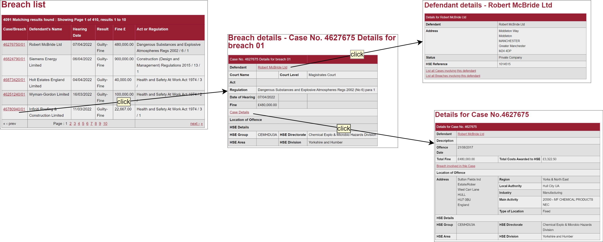

# week2 (网络数据收集主题)


> [!DANGER]  分享内容快速预览：
> - chatGPT 对话场景下,自我学习以下内容
> - python 基础回顾、完善、补充3 (语法;流程控制;逻辑处理;面向对象编程;面向函数编程;等基本概念)
> - python 网络数据整理或收集 (`request`;`pyquery`;`selenium`)
> - 结合 AI工具 完成，网站数据请求，数据响应获取；网页结构，标签解析等；
> - 自动化测试工具 selenium 请求动态网站数据；


> [!NOTE] python 基础
>
> - 字典
> - 数组
> - 类
> - 函数与方法
>
> 安装支持库:
>
> - 打开 miniconda promQpt 以命令行方式安装以下库
>
> - `pip install pandas -U`
>
> - `pip install pyquery -U`
>
> - `pip install selenium -U`
>
> html 标签
>
> -  F12 chrome ,浏览器调试器
> -  标签;
> -  标签属性;
> -  标签文本值;
> -  css 选择器;


> ## case 1:  获取  [ Health and Safety Executive](https://www.hse.gov.uk/index.htm) 数据

!> 任务:  

- 1）获取目标网页 [Breach list](https://resources.hse.gov.uk/convictions-history/breach/breach_list.asp?PN=1&ST=B&EO=LIKE&SN=F&SF=DN&SV=&SO=DHD) 下所有 pages 的 Breach list 表格数据（见下图Breach list）；
- 2）从 Breach list 中解析出所有 Breach id 的超链接，并进一步获取该超链接的网页表格数据（见下图 Breach details）；
- 3）对表格进一步解析得到 defendant details & case details 的超链接并获取次级表格数据。

!>  视屏:

[B站 同步更新 P1: 静态网页数据请求](https://www.bilibili.com/video/BV1Jv4y1E7KQ/?spm_id_from=333.999.0.0)

!> 目标网页网址: 

  https://resources.hse.gov.uk/convictions-history/breach/breach_list.asp?PN=1&ST=B&EO=LIKE&SN=F&SF=DN&SV=&SO=DHD 


!> 获取网站数据内容示图



!>  设计数据请求流程:


> ## case 2: 获取动态加载的数据

!> 任务:  
- 1) 以chrom 为例,自动安装chrom driver;

- 2) 利用selenium, 保存/加载本地 cookies;  

- 3) ...未更新

  
> ##  🤔 case1.prompting 

!> 提醒: 以下内容是网络数据请求实现的prompting过程。
以下是 prompting 过程。

将使用 `python` 库：`requests` `Pyqeury` `pandas`

代码编辑器: [cursor](https://www.cursor.so/)

---

!>  对话式编程。备注:以下内容在代码块中的是 prompt 内容，带有🟢 是旁释

### prompting 

```
#init 访问#end
请使用 requests, PyQuery 库解析以下网址中的 table 标签，并将其转换为 Pandas DataFrame，并将其保存为名为 df 的变量.
https://resources.hse.gov.uk/convictions-history/breach/breach_list.asp?PN=1&ST=B&EO=LIKE&SN=F&SF=DN&SV=&SO=DHD
```

```
检查df 是否要目标网页数据一致 ,这个网站的数结构是多级索引的, 为方便取值先对df进行处理#end
DataFrame 变量 df 是多级索引的 ，请将第 0 层的 columns 索引删除。
```

```
分析网页,开始获取a标签的文本与属性值#end
获取 table 标签下的所有子级 a 标签, 并打印a 标签的文本值
```

```
修改代码#end
修改代码, 当获取 a 标签文本时,判断是否在变量 df 的第一列中,如果是的话将其保留, 并打印出 a 标签的 href 属性值
```

```
这里查看代码时，发现href 没有加前缀，分析网页网址结构#end
修改代码,将符合条件的 a 标签 href 属性加前缀 `https://resources.hse.gov.uk/convictions-history/breach/`
```

```
测试一下这些超链接的正确性,如果没问题, 那将 用a标签文本作为key ,href属性值作为values 构建一个 python 字典#end
创建字典,href_dic, a 标签文本作为 key, a 标签 href 属性值作 value, 最后将 href_dic 转为命为 hrefdf 的 pd对象
```

```
合并列, 对齐的名#end
代码内容增加,将 hrefdf 的第一列列名修改为 df 的第一列名,之后 df 与 hrefdf 按第一列列名 进行交集合并  
```

```
由于该方法会经常被用到,所以在这里将这个方法封装成函数或方法, 全选代码,再对话#end
修改代码, 请将这段代码封装成名为 get_breachlist 的函数方法,   输入参数是 url ,返回结果是 merged_df
```

```
修改 增加一个方法执行时的异常情况判断, 如果解析时 table 没有返回值 或空 或异常, 则返回  None
```

```
到此,我们已经完成对对给定 url 的网页数据请求,剩下的工作是构建 page url 就能用一个循环语句获取所有pages 的数据。首先交给chapGPT分析下page 网页的结构#end
url = 'https://resources.hse.gov.uk/convictions-history/breach/breach_list.asp?PN=1&ST=B&EO=LIKE&SN=F&SF=DN&SV=&SO=DHD'
url = 'https://resources.hse.gov.uk/convictions-history/breach/breach_list.asp?PN=2&ST=B&EO=LIKE&SN=F&SF=DN&SV=&SO=DHD'
url = 'https://resources.hse.gov.uk/convictions-history/breach/breach_list.asp?PN=3&ST=B&EO=LIKE&SN=F&SF=DN&SV=&SO=DHD'

分析上面的规律, 创建一个函数生成对应的 url 字符串
```

```
生成410个url，#end
使用 generate_url 方法 生成 410个网址 并且 保存在 urlist 数组中
```

```
循环执行 get_breachlist 方法，直到结束。（串行获取速度慢）#end
遍历 urlist 数组, 执行 get_breachlist 方法,将返回值保存到 relist数组中
```

```
下面我们改进代码,使用多线程进行的数据获取，先删去刚才的循环语句#end
用多线程方法 启动 get_breachlist 方法,传入 urlist 中的 url直到urlist为空
```

```
修改代码, 保存返回结果时使用线程锁,当结果每增加50个时通知我修改代码, 保存返回结果时使用线程锁
```

```
保存结果，到本地*.pkl#end
将pandas 类型的变量 df ,保存为  breachlist 的pkl 文件
```

###  one prompt 

```
#init{1-15}
用一个 prompt 总结以上步骤 #end
第一个任务:
编写一个函数名为 get_breachlist，该函数需要导入 requests、PyQuery、pandas等库。该函数的输入参数为url，实现以下内容：
a) 使用 requests、PyQuery、pandas等库访问给定的 url，解析其中的 table标签，并将其转换为 Pandas DataFrame，将其保存为名为 df 的变量。如果 DataFrame 变量 df 是多级索引的，则删除第0层的 columns 索引。
b) 创建 href_dic 字典，首先获取 table 标签下的所有子级 a 标签的文本值作为键，获取 a 标签的 href 属性值并加上前缀 https://resources.hse.gov.uk/convictions-history/breach/作为值。
c) 将 href_dic 字典转换为 DataFrame，变量名为 href_df，字典的key值作为第一列, value 作为第二列, href_df 的第一列名要求与变量 df 的第一列一致.
d) 将变量 df 与变量 href_df 按第一列对齐，进行交集合并，作为 get_breachlist 的返回值。
e) 对函数进行修改，让其更加稳健。

第二个任务:
url = 'https://resources.hse.gov.uk/convictions-history/breach/breach_list.asp?PN=1&ST=B&EO=LIKE&SN=F&SF=DN&SV=&SO=DHD'
url = 'https://resources.hse.gov.uk/convictions-history/breach/breach_list.asp?PN=2&ST=B&EO=LIKE&SN=F&SF=DN&SV=&SO=DHD'
url = 'https://resources.hse.gov.uk/convictions-history/breach/breach_list.asp?PN=3&ST=B&EO=LIKE&SN=F&SF=DN&SV=&SO=DHD'
根据上面已给出的 3个url ,分析规律并创建一个 generate_url 函数,实现生成对应的 url 字符串, 利用该方法生成 410 个网址并且 保存在 urlist 数组中.

第三个任务:
使用多线程方法,线程数量为100, 执行 get_breachlist 方法, 将数组 urlist 所有元素作为参数传入,注意传入 urlist 与保存返回值时都要用到线程锁,返回值每增加100个时, 输入提示

当以上任务完成后,将所有获取到的返回值整理成一个dataframe,重置索引去重,排序操作后以 pickel 的格式保存至本地
```
<br>

>[!TIP]
```python
# 第一个任务
import requests
from pyquery import PyQuery as pq
import pandas as pd

def get_breachlist(url):
    # 使用 requests 库访问给定的 url
    response = requests.get(url)
    # 使用 PyQuery 库解析其中的 table 标签
    doc = pq(response.text)
    table = doc('table')
    # 将 table 标签转换为 Pandas DataFrame，将其保存为名为 df 的变量
    df = pd.read_html(str(table))[0]
    # 如果 DataFrame 变量 df 是多级索引的，则删除第0层的 columns 索引
    if isinstance(df.columns, pd.MultiIndex):
        df.columns = df.columns.droplevel(0)
    # 创建 href_dic 字典，首先获取 table 标签下的所有子级 a 标签的文本值作为键，获取 a 标签的 href 属性值并加上前缀 https://resources.hse.gov.uk/convictions-history/breach/作为值
    href_dic = {}
    for a in table.find('a'):
        href_dic[pq(a).text()] = 'https://resources.hse.gov.uk/convictions-history/breach/' + pq(a).attr('href')
    # 将 href_dic 字典转换为 DataFrame，变量名为 href_df，字典的key值作为第一列, value 作为第二列, href_df 的第一列名要求与变量 df 的第一列一致
    href_df = pd.DataFrame(list(href_dic.items()), columns=[df.columns[0], 'href'])
    # 将变量 df 与变量 href_df 按第一列对齐，进行交集合并，作为 get_breachlist 的返回值
    result = pd.merge(df, href_df, on=df.columns[0], how='inner')
    return result

# 对函数进行修改，让其更加稳健
def get_breachlist(url):
    try:
        response = requests.get(url)
        response.raise_for_status()
    except requests.exceptions.RequestException as e:
        print(e)
        return None
    doc = pq(response.text)
    table = doc('table')
    try:
        df = pd.read_html(str(table))[0]
    except ValueError:
        print('No tables found')
        return None
    if isinstance(df.columns, pd.MultiIndex):
        df.columns = df.columns.droplevel(0)
    href_dic = {}
    for a in table.find('a'):
        href_dic[pq(a).text()] = 'https://resources.hse.gov.uk/convictions-history/breach/' + pq(a).attr('href')
    href_df = pd.DataFrame(list(href_dic.items()), columns=[df.columns[0], 'href'])
    result = pd.merge(df, href_df, on=df.columns[0], how='inner')
    return result

# 第二个任务
def generate_url(page_num):
    return f'https://resources.hse.gov.uk/convictions-history/breach/breach_list.asp?PN={page_num}&ST=B&EO=LIKE&SN=F&SF=DN&SV=&SO=DHD'

urlist = [generate_url(i) for i in range(1, 411)]

# 第三个任务
import threading

lock = threading.Lock()
results = []

def get_breachlist_thread(url):
    result = get_breachlist(url)
    with lock:
        results.append(result)
        if len(results) % 100 == 0:
            print(f'{len(results)} urls processed')

threads = []
for url in urlist:
    t = threading.Thread(target=get_breachlist_thread, args=(url,))
    threads.append(t)
    t.start()

for t in threads:
    t.join()

# 将所有获取到的返回值整理成一个dataframe,重置索引去重,排序操作后以 pickel 的格式保存至本地
df = pd.concat(results, ignore_index=True)
df.drop_duplicates(inplace=True)
df.sort_values(by=df.columns[0], inplace=True)
df.reset_index(drop=True, inplace=True)
df.to_pickle('breachlist.pkl')
```


```

获取二级表，所有 case 对应的 `breach details` `details for case#` `Defendant details` #end
task 1
用pandas 读取本地目录下 breachlist.pkl 文件 ,保存为变量df
取出 df 的最后一列,转为list类型 保存为 urlist

task 2
创建一个 exp_excel 方法传入参数是 url,实现以下功能:
1 先创建局部变量 dflist cdlist  2个空数组 
2 再创建一个子方法 get_datails ,传入参数是 url: 实现以下内容
a) 声明使用 局部变量 dflist  与 cdlist  
b) 先用request , pyquery 获取 url 内容并解析 table 标签, 并将其转换为 DataFrame, 类型数据 并存入局部变量 dflist中

c) 另外, 我需要你遍历 table 标签下的所有子级 a 标签, 判断该标签的href  属性值是否包含 "case_details" 或 "defendant_details",如果是则将属性值的 ".." 替换为 "https://resources.hse.gov.uk/convictions-history", 
d) 当a标签 href 属性值包含 "case_details" 或  "defendant_details" 的情况时判断是否已经在 cdlist  数组中, 如果已存在则跳过,如果不存在则先存入 cdlist  数组,再执行 get_datails 方法,;
e) 如果不包含 "case_details" 或 "defendant_details" 字符的情况下, 跳过 ; 
到此, get_datails 定义结束

exp_excel  方法在上述的任何情况只要解析失败或异常时,请抛出异常返回0,  一切正常情况下 exp_excel  方法 的返回值是  dflist 元组

```

```
代码内容新增加, 写一个多线程任务, 对 urlist 中所有元素执行 exp_excel 方法, 
记录所有urlist 数组中元素执行的是否成功, 如果不成功能的重新传入执行,线程数量设定为50 , 
方法返回结果要用线程锁, 保存至reslist 数组中, 线程成功执行每100条 打印一次通知
```

```
用pickle 的方法 保存 relist 变量到本地
```

!> 最终完整代码

```python
# Task 1
import pandas as pd

# Read the breachlist.pkl file and save it as a dataframe variable df
df = pd.read_pickle('breachlist.pkl')

# Get the last column of df and convert it to a list, save it as urlist
urlist = df.iloc[:, -1].tolist()

# Task 2
import requests
from pyquery import PyQuery as pq

def exp_excel(url):
    # Create two empty arrays dflist and cdlist
    dflist = []
    cdlist = []
    
    # Define the get_datails function
    def get_datails(url):
        # Use the dflist and cdlist variables defined in the parent function
        nonlocal dflist, cdlist
        
        # Use requests and pyquery to get the content of the url and parse the table tag, then convert it to a DataFrame and save it to the dflist variable
        try:
            html = requests.get(url).text
            doc = pq(html)
            table = doc('table')
            df = pd.read_html(str(table))[0]
            dflist.append(df)
        except:
            raise Exception('Failed to parse table')
        
        # Traverse all child a tags under the table tag, and determine whether the href attribute value of the tag contains "case_details" or "defendant_details". If it does, replace ".." in the attribute value with "https://resources.hse.gov.uk/convictions-history"
        for a in table.find('a'):
            href = a.attrib.get('href')
            if href and ('case_details' in href or 'defendant_details' in href):
                href = href.replace('..', 'https://resources.hse.gov.uk/convictions-history')
                
                # If the href attribute value of the a tag contains "case_details" or "defendant_details", check whether it is already in the cdlist array. If it exists, skip it. If it does not exist, first save it to the cdlist array, and then execute the get_datails method.
                if href not in cdlist:
                    cdlist.append(href)
                    get_datails(href)
            else:
                # If the href attribute value of the a tag does not contain "case_details" or "defendant_details", skip it.
                continue
    
    # Call the get_datails function with the input url
    try:
        get_datails(url)
    except:
        raise Exception('Failed to get details')
    
    # Return the dflist tuple if everything is normal, or return 0 if an exception is thrown during execution
    return tuple(dflist) if dflist else 0

import threading

# Define a lock variable
lock = threading.Lock()

# Define a function to execute the exp_excel method and save the result to the reslist array
def execute_exp_excel(url):
    # Use the global variables urlist and reslist
    global urlist, reslist
    
    # Call the exp_excel method with the input url
    result = exp_excel(url)
    
    # Use the lock variable to ensure thread safety when modifying the reslist array
    with lock:
        # If the result is not 0, append it to the reslist array
        if result != 0:
            reslist.append(result)
        # If the result is 0, try to execute the exp_excel method again, up to 3 times
        else:
            for i in range(3):
                result = exp_excel(url)
                if result != 0:
                    reslist.append(result)
                    break
    
    # Print a notification every 100 successful executions
    if len(reslist) % 100 == 0:
        print('Successfully executed {} urls'.format(len(reslist)))

# Define a function to create and start threads
def create_and_start_threads():
    # Use the global variables urlist and reslist
    global urlist, reslist
    
    # Create a list to store threads
    threads = []
    
    # Create and start threads for each url in urlist
    for url in urlist:
        # Create a thread and add it to the threads list
        t = threading.Thread(target=execute_exp_excel, args=(url,))
        threads.append(t)
        
        # If the number of threads in the threads list is equal to 50, start all threads and clear the threads list
        if len(threads) == 50:
            for thread in threads:
                thread.start()
            for thread in threads:
                thread.join()
            threads.clear()
    
    # If there are any remaining threads in the threads list, start and join them
    if threads:
        for thread in threads:
            thread.start()
        for thread in threads:
            thread.join()

# Create an empty reslist array
reslist = []

# Call the create_and_start_threads function to execute the exp_excel method for each url in urlist using multiple threads
create_and_start_threads()

import pickle

# 用pickle.dump()方法将relist变量保存到本地
with open('relist.pickle', 'wb') as f:
    pickle.dump(reslist, f)
```

> ##  🤔 case2.prompting


🟢1 使用 selenium 时,以 chrome 为例, 需要更新 chrome driver 的最新版.
```
#init{1}
用到python 的 selenium时 需要 chrome driver 这个有什么库可以自动更新
```
```
使用 selenium 登陆 以下网址, 给我10秒时间用于登陆,   之后你创建读取 与保存cookies 到本地目录的2个方法,    第一次时, 你将保存我的登陆 cookies信息,
```

(selenium 的待补充)


